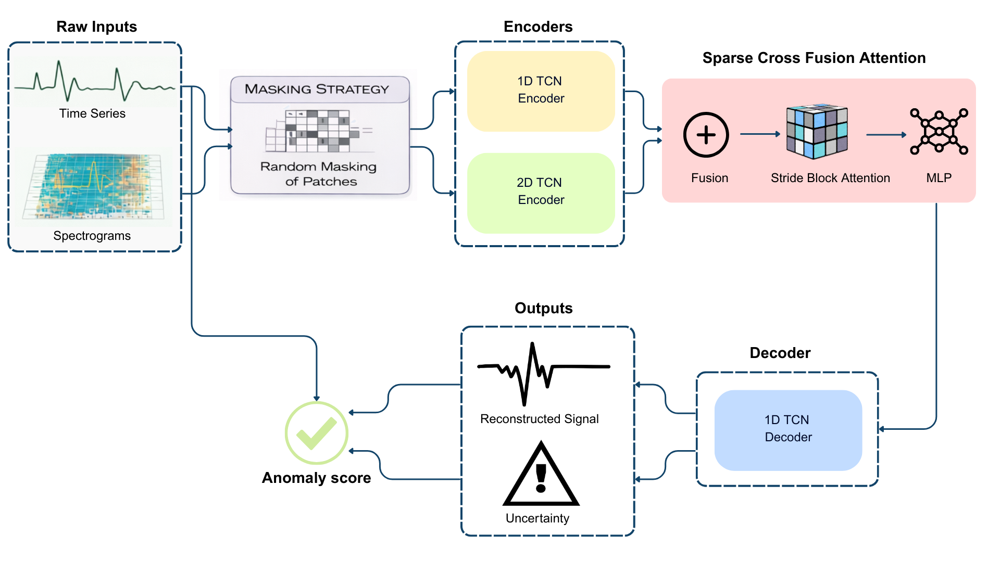

# STAE: Sparse Temporal AutoEncoder for ECG Anomaly Detection

## Abstract

  
Electrocardiogram (ECG) analysis is a fundamental tool for diagnosing various cardiac conditions; however, accurately distinguishing between normal and abnormal ECG signals remains challenging due to high inter-individual variability and the inherent complexity of ECG waveforms.
In this study, we propose a novel Sparse Temporal Autoencoder (STAE) for unsupervised ECG anomaly detection that leverages Temporal Convolutional Networks (TCNs) to extract hierarchical features from both time-domain and frequency domain representations of ECG signals...
  
## Required Libraries
- Pytorch
- Numpy
- TQDM
- SciPy
- HeartPy
- PyWavelets
- Scikit-Learn

## Cite this work

🖋️ If you find this code useful in your research, please cite:

```bibtex
@article{daci2026sparse,
  title={Sparse Temporal AutoEncoder for ECG Anomaly Detection},
  author={Daci, Radia and Taleb-Ahmed, Abdelmalik and Patrono, Luigi and Distante, Cosimo},
  journal={Sensors},
  volume={26},
  number={5},
  pages={1589},
  year={2026},
  publisher={MDPI}
}

## Datasets
To assess the performance of our model, we conduct experiments using the PTB-XL dataset. The dataset preprocessing follows the approach outlined in <a href="https://github.com/UARK-AICV/TSRNet">TSRNet.</a> For further information, please refer to their repository.</a>

## Usage

### Training

```python
python train.py --data_path ./data/ --save_model 1 --save_path ./ckpt/STAE.pt
```

### Testing
```python
python test.py --data_path ./data/ --load_model 1 --load_path ./ckpt/STAE.pt
```

## Acknowledgment
A part of this code is adapted from these earlier works: [TSRNet.](https://github.com/UARK-AICV/TSRNet) and [Katharopoulos et al.](https://github.com/locuslab/TCN)

## Contact
If you have any questions, please feel free to create an issue on this repository or contact us at <radia.daci@isasi.cnr.it>.
